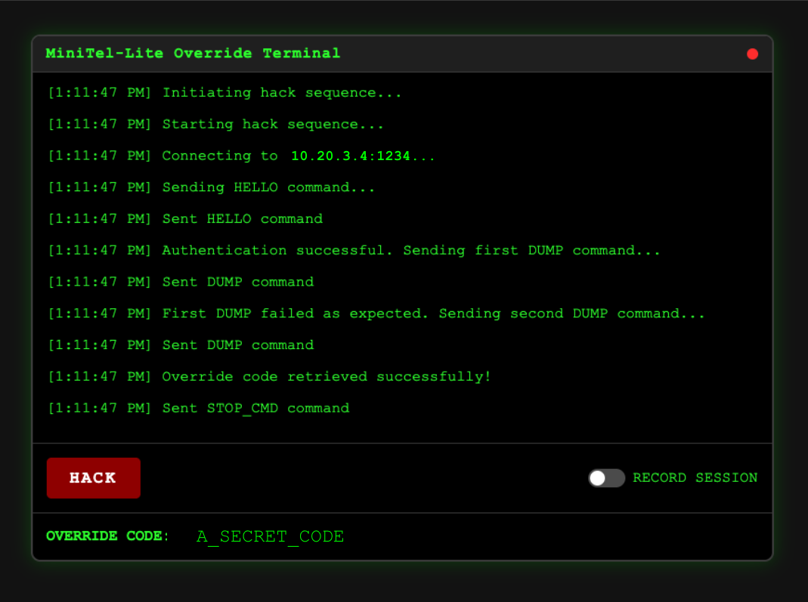

# MiniTel-Lite Override Terminal

## Mission Critical: NORAD Emergency Override System

November 26, 1983. 15:42 GMT. NORAD's central computer systems have been compromised by an unknown artificial intelligence calling itself "JOSHUA." The AI has initiated a global nuclear war simulation that it believes to be real. All conventional override protocols have failed.

This application allows authorized personnel to connect to the MiniTel-Lite server, authenticate using the HELLO protocol, and retrieve the emergency override codes needed to stop JOSHUA before it launches a real nuclear strike.



## Architecture Design

The application follows a clean, layered architecture with strict separation of concerns:

1. **Proxy Layer**: A Node.js server that acts as a bridge between the frontend and the MiniTel-Lite TCP server. It handles the low-level TCP communication, protocol encoding/decoding, nonce management, and session recording.

2. **Frontend Layer**: A simple HTML/JS/CSS application that provides a user-friendly interface for interacting with the proxy. It offers a HACK button to initiate the override sequence and displays status updates and the retrieved override code.

3. **TUI Layer**: A standalone terminal-based tool for replaying recorded sessions, allowing for analysis of past interaction sequences.

4. **Testing Layer**: Comprehensive automated tests that verify protocol correctness, error handling, and robustness against various edge cases.

### Key Design Decisions

1. **WebSocket Communication**: The frontend communicates with the proxy server via WebSockets, enabling real-time status updates and bidirectional communication.

2. **Protocol Encapsulation**: All protocol-specific logic (encoding, decoding, nonce management) is encapsulated in dedicated modules, making it easier to adapt to protocol changes or version updates.

3. **Session Recording**: The application includes a built-in session recording feature that captures all client-server interactions for later analysis or debugging.

4. **Error Handling**: Comprehensive error handling is implemented at all layers, with appropriate user feedback and logging for troubleshooting.

5. **Nonce Management**: A dedicated nonce manager ensures correct sequence tracking and validation, reducing the risk of protocol violations.

6. **Stateful Protocol Handling**: The proxy maintains the necessary state to handle the stateful aspects of the MiniTel-Lite protocol, including the DUMP count and automatic reconnection logic.

## Getting Started

### Prerequisites

- Node.js v16 or higher
- npm or yarn

### Installation

1. Clone the repository:
   ```
   git clone [repository-url]
   cd minitel-lite
   ```

2. Install dependencies:
   ```
   npm install
   ```

3. Configure the application:
   ```
   cp .env.example .env
   ```
   Edit the `.env` file to set the correct server host, port, and other settings.

### Running the Application

1. Start the proxy server:
   ```
   npm start
   ```

2. Open your browser and navigate to:
   ```
   http://localhost:8080
   ```

3. Click the HACK button to initiate the override sequence.

### Session Recording

1. Enable session recording by toggling the "RECORD SESSION" switch in the UI.
2. Perform the hack sequence.
3. Disable recording when finished.
4. Recorded session files are stored in the `recordings` directory with timestamp-based filenames.

### Session Replay

Use the TUI replay tool to review recorded sessions:

```
node tui/replay.js recordings/session-[timestamp].json
```

Navigation:
- N: Next step
- P: Previous step
- Q: Quit

## Testing

### Running Tests

Execute the test suite:

```
./run_tests.sh
```

Or run specific tests:

```
npm test
```

### Test Coverage

The test suite covers:

1. **Protocol Validation**: Verifies correct encoding/decoding and hash validation.
2. **Nonce Handling**: Tests nonce sequence tracking and validation.
3. **Integration Testing**: End-to-end tests that verify the complete protocol flow.
4. **Error Handling**: Tests for timeout handling, disconnection recovery, and protocol violations.

## Edge Case Handling

The application handles various edge cases:

1. **Connection Failures**: Automatic retry with appropriate user feedback.
2. **Server Disconnections**: Reconnection logic with state recovery.
3. **Protocol Violations**: Proper error handling and reporting.
4. **Timeouts**: Both idle and response timeouts are handled.
5. **Invalid Frames**: Detection and rejection of malformed or tampered frames.

## Security Considerations

1. Server connection details are loaded from environment variables, not hardcoded.
2. All protocol communications use SHA-256 hashing for integrity validation.
3. No sensitive information is exposed in logs or UI elements.

## Project Structure

```
minitel-lite/
│
├── proxy/                     # Node.js local proxy (TCP <-> WebSocket)
│   ├── proxy.js               # Main proxy server entry point
│   ├── protocol/              # Protocol-specific code
│   │   ├── encoder.js         # Frame encoding
│   │   ├── decoder.js         # Frame decoding
│   │   ├── nonce.js           # Nonce handling utilities
│   │   └── constants.js       # Command codes, timeouts
│   ├── recorder/              # Session recording logic
│   │   └── recorder.js
│   ├── config/                
│   │   └── index.js           # Loads environment variables
│   └── tests/                 # Unit tests for proxy components
│
├── frontend/                  # UI for interaction
│   ├── index.html             # Main HTML page
│   ├── app.js                 # Frontend logic
│   └── style.css              # Styling
│
├── tui/                       # Terminal UI for session replay
│   └── replay.js              # Session replay tool
│
├── recordings/                # Stored session recordings
│
├── assets/                    # Static assets
│   └── demo_ui.png            # Screenshot of the UI
│
├── tests/                     # Integration tests
│   ├── integration.test.js    # End-to-end tests
│   └── mock-server.js         # Mock server for testing
│
├── run_tests.sh               # Test runner script
├── README.md                  # Documentation
├── package.json               # Node.js project file
├── .env.example               # Example configuration
└── .gitignore                 # Git ignore rules
```

## License

This project is classified under mission-critical emergency response systems and is authorized for use by approved personnel only.